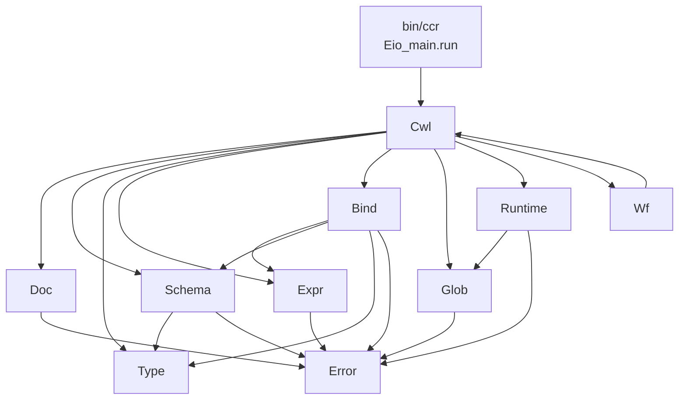
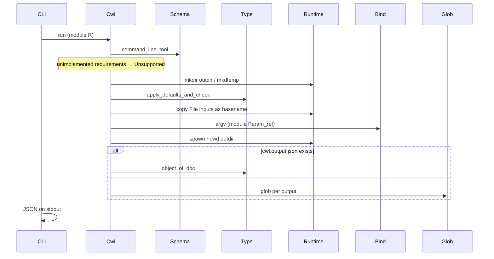

# caml-cwl-runner

A CWL v1.2.1 runner in OCaml 5.5. Binary: `ccr`.

Architecture of the engine: modules, guarantees, and how CommandLineTool
and Workflow execution fit. Signatures match `lib/*.mli` and private
`lib/data.ml`. JavaScript, Docker, and Workflow are extra modules of the
same `ENGINE` / `RUNTIME` / facade signatures.

Source of truth, in order:

1. CWL v1.2.1 specification ([CommandLineTool](https://www.commonwl.org/v1.2/CommandLineTool.html), [Workflow](https://www.commonwl.org/v1.2/Workflow.html), [invocation.md](https://github.com/common-workflow-language/cwl-v1.2/blob/main/invocation.md))
2. CWL v1.2 conformance tests
3. cwltool, only for a disputed corner

Public `.mli` files are authoritative when they differ from this document.

---

## 1. Purpose

`ccr` loads a CWL process and a job, runs the process, and prints the CWL
output object as JSON on stdout.

The engine is a sealed OCaml library (`Cwl`) plus a thin CLI. The CLI
starts the Eio scheduler, maps `Error.t` to exit codes, and prints JSON.

---

## 2. Binary contract

```
ccr [--outdir DIR] [--quiet] [--version] PROCESS JOB
```

| Outcome | stdout | stderr | exit |
|---|---|---|---|
| success | output object JSON | diagnostics unless `--quiet` | 0 |
| unimplemented feature required now | — | error | **33** |
| other expected failure | — | error | 1 |
| missing PROCESS or JOB | — | usage | 2 |
| `--version` | version string | — | 0 |

`--outdir` is the CWL output directory. If omitted, the runner creates a
temporary directory and leaves it on disk.

`--quiet` suppresses diagnostics, not errors.

`cwl-runner` is a second public name of this binary for `cwltest`, not a
second implementation.

JSON owns stdout. Tool stdout/stderr are files in `outdir`, never mixed
with the output object.

---

## 3. Design principles

- `.mli` is the design. If it is not in a signature, it is not a guarantee.
- ADTs live once in private `Data` (`lib/data.ml`) and are `include`d into
  `Cwl.Error`, `Cwl.Doc`, `Cwl.Type`, `Cwl.Schema`, `Cwl.Expr`.
- Effectful boundaries are module-dependent functions:
  `(module E : ENGINE) -> …`, `(module FILE)`, `(module RUNTIME)`,
  `(module Glob.FS)`. Not an IO monad and not objects.
- Stdlib + `Result.t` for expected failure. Missing inputs are `Error.t`,
  not exceptions.
- No objects, `Obj`, or `Hashtbl` unless a Runtime body needs them.
- I/O only in `Doc` (document load) and `Runtime` (FS + spawn). `Glob` is
  pure given `FS`. `Bind`, `Schema`, `Type`, `Expr.Param_ref` are pure.
- Eio is the Runtime body and the CLI scheduler (`Eio_main.run`). Lwt is
  not used. Schema, Bind, Type, and Glob do not mention Eio.
- Known-unimplemented CWL is a `diagnostic`, never a silent drop.

Salad compact forms (`T?`, `T[]`, identifier maps) are decoded by hand from
`Doc.value`. No ppx derivers.

---

## 4. Module map



| Module | Files | Role |
|---|---|---|
| `Error` | `error.mli` | `Error.t` vs `diagnostic` vs `'a annotated` |
| `Doc` | `doc.mli` | YAML/JSON tree. Does not leak `Yaml.value` |
| `Type` | `ty.ml` / `ty.mli`, public `Cwl.Type` | Avro-ish types and runtime values |
| `Schema` | `schema.mli` | `CommandLineTool` as records; Workflow when present |
| `Expr` | `expr.mli` | Parameter-reference `ENGINE`; JS is another `ENGINE` |
| `Bind` | `bind.mli` | `inputBinding` → argv |
| `Glob` | `glob.mli` | POSIX glob + CWL rules against `(module FS)` |
| `Runtime` | `runtime.mli` | Stage, temp dirs, spawn. Local body is Eio |
| `Cwl` | `cwl.mli` | Sealed facade: `command_line`, `run` |
| `Wf` | — | Workflow graph on the same Eio scheduler |

Dependency direction: `Type` does not depend on `Schema`. Nested array
`inputBinding` lives on `Type.t` as `item_binding` so Schema can depend on
Type without a cycle. `Glob` does not depend on Runtime; Runtime implements
`Glob.FS`.

---

## 5. Data model

All of these are in `lib/data.ml`. Public modules `include` their part.

### 5.1 Error

```ocaml
type t =
  | Parse of { path : string option; message : string }
  | Schema of { path : string; message : string }
  | Unsupported of { feature : string }
  | Type of { param : string; expected : string; got : string }
  | Expr of { message : string }
  | Missing of { param : string }
  | Runtime of { message : string }

type diagnostic = {
  feature : string;
  json_path : string;
  in_requirements : bool;
  message : string;
}

type 'a annotated = { value : 'a; diagnostics : diagnostic list }
```

`Error.t` means the current operation cannot produce a result.
`diagnostic` means a construct was parsed and is not implemented.
`in_requirements = true` is fatal **at execute** (`Unsupported`, exit 33),
not at argv. Hints keep `in_requirements = false` and execution proceeds.

CLI map: `Unsupported` → 33; other `Error.t` → 1.

### 5.2 Doc

```ocaml
type value =
  | Null | Bool of bool | Int of int64 | Float of float
  | String of string | Array of value list | Object of (string * value) list

module type FILE = sig
  val read : string -> (string, Error.t) result
end
```

`yaml` delivers integers as floats. `Doc` recovers integral floats as `Int`.
`$import` / `$include` / `$graph` present on a document: diagnostic, and
`Unsupported` if a process cannot be chosen without them.

Default `FILE` is `In_channel`. Document load is stdlib; Runtime is Eio.
HTTP `$import` would need a `FILE` (or Runtime) that can fetch.

### 5.3 Type

```ocaml
type t =
  | Null | Boolean | Int | Long | Float | Double | String
  | File | Directory
  | Array of { items : t; item_binding : binding option }
  | Union of t list

type value =
  | Vnull | Vbool of bool | Vint of int64 | Vfloat of float
  | Vstring of string | Vfile of file | Vdir of directory
  | Varray of value list | Vrecord of (string * value) list
```

Optionality is `Union`, not a flag on every field. `File.path` is
`string option` so “not yet staged” is visible. `Vrecord` exists; Schema
does not yet build CWL record types (SchemaDef / `record` → diagnostic).

`Any` parses as `String` plus a diagnostic. `enum` / `record` types
likewise degrade to `String` + diagnostic until SchemaDef is decoded.

### 5.4 Schema (CommandLineTool)

CommandLineTool is one record.

```ocaml
type requirement =
  | Resource of { cores_min : float option }
  | Unimplemented of { class_ : string; in_requirements : bool }

type stream = Stdout | Stderr | No_stream

type output = {
  id : string;
  ty : cwl_type;
  output_binding : output_binding option;
  stream : stream;
  unimplemented : Error.diagnostic list;
}

type command_line_tool = {
  cwl_version : string;
  class_ : string;
  base_command : string list;
  arguments : argument list;
  inputs : input list;
  outputs : output list;
  stdout : string option;
  stdin : string option;
  stderr : string option;
  success_codes : int list;
  requirements : requirement list;
  hints : requirement list;
}
```

Parser rule, every object (tool, input, output, binding, requirement):

- Known and implemented → decode.
- Known and not implemented → stub + diagnostic. Never drop the key.
- `$namespaces`-prefixed extension → diagnostic `extension …`.
- Unprefixed unknown → diagnostic `unknown field …`.

`class` ≠ `CommandLineTool` (and not empty): parse the rest, diagnostic on
`class`, then `command_line` / `run` return `Unsupported`.

`type: stdout` / `type: stderr` are File + `stream`. Missing `stdout:`
field with a stdout-typed output: execute picks a filename (`cwl.stdout`).

`successCodes` default `[0]` when absent.

### 5.5 Expr

```ocaml
type runtime = {
  outdir : string;
  tmpdir : string;
  cores : float;
  ram : float;
}

type context = {
  inputs : Type.object_;
  self : Type.value;
  runtime : runtime;
}

module type ENGINE = sig
  val eval : ctx:context -> expr:string -> (Type.value, Error.t) result
end
```

`Param_ref` implements the spec BNF for `$(inputs…)`, `$(self…)`,
`$(runtime…)`, `$(null)`. `${…}` or a `$(…)` that is not a parameter
reference → `Unsupported { feature = "InlineJavascriptRequirement" }`.
String interpolation (`foo$(bar)`) is the same class of error.

`module Js : ENGINE` is a second implementation of this signature.
`Bind.argv` and glob-pattern evaluation take `(module ENGINE)` and do not
grow a JavaScript-specific parameter.

`runtime.cores` comes from `ResourceRequirement.coresMin` in requirements,
else hints, else `1.`. `outdir` / `tmpdir` are real paths at execute;
placeholders only in argv-only tests.

---

## 6. Effectful module arguments

Impurity is a module argument.

```ocaml
Doc.load      : (module FILE) -> path:string -> (Doc.value, Error.t) result
Bind.argv     : (module Expr.ENGINE) ->
                tool:Schema.command_line_tool ->
                inputs:Type.object_ ->
                runtime:Expr.runtime ->
                (string list, Error.t) result
Glob.glob     : (module Glob.FS) ->
                root:string -> pattern:string ->
                ?roots:string list -> unit ->
                (string list, Error.t) result
Cwl.run       : (module Runtime.RUNTIME) ->
                ?outdir:string ->
                tool_path:string -> job_path:string ->
                unit ->
                (Type.object_ Error.annotated, Error.t) result
Runtime.local : Eio_unix.Stdenv.base -> (module RUNTIME)
```

The CLI:

```ocaml
Eio_main.run @@ fun env ->
  Cwl.run (Cwl.Runtime.local env) ?outdir ~tool_path ~job_path ()
```

Tests inject a fake `RUNTIME` or `Glob.FS` with no scheduler. Spawn tests
wrap `Eio_main.run`.

A Docker `RUNTIME` can be a functor or a packed module. Call-sites that
only pass an expression engine or an `FS` use the 5.5 module-dependent
function.

---

## 7. Bind — argv

Algorithm follows invocation.md.

Sort key is a list of `I of int | S of string`. Numeric position, then
input id, then array index. `arguments` sort among inputs at the same
position. Tie-break: name.

- `null` / optional missing → no tokens.
- Boolean `true` + prefix → prefix token; `false` → silent.
- `itemSeparator` → one joined token.
- `separate:false` → prefix concatenated with value.
- Nested array `inputBinding.prefix` is `item_binding` on `Type.Array`.
- File/Directory tokens are `Type.file.path` (or location). Bind does not
  open files.
- `valueFrom` goes through `ENGINE`. JS → `Unsupported` from `Param_ref`.
- `position` as expression likewise.

Worked key (nested arrays, `binding-test.cwl` shape): parent position `I 3`,
parent name `S "reads"`, then each item `I 0`, `I 1`, … with the item’s own
prefix. `itemSeparator` on the parent emits one `Value` at the parent key
and does not walk items.

`Cwl.command_line` is argv-only: load, schema, defaults, `Bind.argv`,
return `{ value = argv; diagnostics }`. `Cwl.run` executes. The test
helper that drops `python` plus `args.py` from argv is not library
behaviour.

---

## 8. Glob

`Cwl.Glob` is a module. Runtime does not contain glob logic.

### 8.1 Signature

```ocaml
module type FS = sig
  val exists : string -> bool
  val is_dir : string -> bool
  val read_dir : string -> (string list, Error.t) result
  val realpath : string -> (string, Error.t) result
end

val glob :
  (module FS) ->
  root:string ->
  pattern:string ->
  ?roots:string list ->
  unit ->
  (string list, Error.t) result
```

Returns existing paths, sorted, unique, relative to `root` joined onto
`root`. Files and directories both. The caller filters by CWL type
(`capture_files` / `capture_dirs` / `capture_files_and_dirs`).
`roots` defaults to `[root]`.

The walker does not `read_dir` a directory whose `realpath` is outside
the allowed roots (output directory, temp directory, Directory input
sources). A symlink *name* under `root` may still be a hit; execute
then rejects the hit if the target is outside those roots. Hits are
the glob paths, not the symlink target.

### 8.2 Language

Spec: POSIX glob(3) pathname matching, relative to the output directory.

Conformance matches POSIX glob as used by Python `glob.glob` on
`os.path.join(outdir, pattern)`, and rejects a pattern that starts with `/`.
That is the language here, not bash:

| Feature | Behaviour |
|---|---|
| `*` `?` `[…]` | yes (`Re.Glob`) |
| `*` `?` do not match `/` | `~pathname:true` |
| leading `.` not matched by `*`/`?` | `~period:true` |
| backslash escapes | yes |
| brace `{a,b}` | **off** (not POSIX glob(3)) |
| `**` | compiler accepts (`~double_asterisk:true`); the walker implements it |
| pattern starting with `/` | `Error.Runtime`, except a pattern that *is* `root` (`$(runtime.outdir)`, `.`) |
| `..` after join | `Error.Runtime` (no escape from `outdir`) |
| missing matches | `[]`, not an error |

Pattern compile is `Re.Glob.glob_result`. Walk is ours, component-wise on
`FS.read_dir`. Tests use an in-memory tree. Runtime’s Eio body is just an
`FS`.

`$(runtime.outdir)` as a glob: after `ENGINE` eval it is an absolute path
equal to `root`. `relativize` strips that prefix and glob of `.` returns
`[root]` if it exists (Directory outputs).

Worked walk for `dir/*.txt` under `root=/out`:

1. Split → `["dir"; "*.txt"]`.
2. `dir` is literal → descend `/out/dir` if it is a directory.
3. `*.txt` is compiled `Re.Glob`; `read_dir /out/dir`; keep names that
   match and exist.
4. Sort unique.

`*` on `/out` with entries `.hidden` and `visible` returns only
`/out/visible`.

### 8.3 Pattern compiler

The spec names glob(3). Conformance follows Python `glob`. `Re.Glob`
implements that language (`[…]`, hidden-file rules, `**`). CWL constraints
(relative to `outdir`, reject `..`, reject foreign absolute paths) live in
`Cwl.Glob`, not in the compiler.

`dune-glob` is dune’s language, not POSIX. Direct libc `glob(3)` via ctypes
is an alternative; `ocaml-re` is the declared dependency.

---

## 9. Runtime

```ocaml
type node = [ `Not_found | `File | `Directory | `Symlink | `Other ]

module type RUNTIME = sig
  include Glob.FS
  val mkdir_p : string -> (unit, Error.t) result
  val abspath : string -> (string, Error.t) result
  val mkdtemp : prefix:string -> (string, Error.t) result
  val copy_file : src:string -> dst:string -> (unit, Error.t) result
  val read_file : string -> (string, Error.t) result
  val write_file : string -> string -> (unit, Error.t) result
  val file_size : string -> (int64, Error.t) result
  val lstat : string -> node
  val stat : string -> node
  val realpath : string -> (string, Error.t) result
  val confined :
    roots:string list -> path:string -> (unit, Error.t) result
  val spawn :
    cwd:string ->
    stdin_file:string option ->
    stdout_file:string option ->
    stderr_file:string option ->
    argv:string list ->
    (int, Error.t) result
end

val local : Eio_unix.Stdenv.base -> (module RUNTIME)
```

Strings + `Result.t` on the signature so tests fake it without Eio.
`Runtime.local env` closes over `Eio.Stdenv.fs`, `cwd`, and `process_mgr`.
Relative paths resolve against process cwd; absolute paths against `fs`.

`spawn` uses `Eio.Process.spawn` / `await` with **child** cwd. Stdio that
the CWL document names become files; otherwise `/dev/null`. Tool bytes never
hit `ccr` stdout. Non-zero is an exit code returned to `Cwl.run`, not
treated as success. Signals become `Error.Runtime`.

Eio exceptions map to `Error.Runtime`.

### 9.1 Why Eio

- `Unix.create_process` cannot set child cwd.
- Process-global `chdir` (Bos `with_current`) races with concurrent steps.
- Workflow fans out steps as fibers on this scheduler.
- Lwt is not used.

A Docker Runtime is another `(module RUNTIME)`, not a fork of Bind or
Schema. It stages files, fills `Type.file.path` with the path the process
sees, and `spawn` runs the argv in a container.

### 9.2 Staging

Input `File` / `Directory`:

1. Resolve `location` (strip `file://`) relative to the job file’s directory.
2. Copy the file into `outdir` under `basename`.
3. Set `path = Some basename` so Bind’s tokens stay basename (cwd is
   `outdir`). Collision on basename → `Error.Runtime`.
4. Directories are not copied. `path` / `location` stay the resolved
   source. Recursive listing is InitialWorkDir.

File basename, stdout, stderr, and stdin names must be a single path
segment: not empty, not `.` / `..`, no `/` or `\\`. Otherwise a job can
write outside `outdir`.

Copy, not symlink: deleting `outdir` must not delete the user’s inputs.

File copies are from a regular file (`stat` after follow). Stdout,
stderr, and stdin opens do not follow a pre-existing destination
symlink.

### 9.3 Confinement

Legal roots: `realpath` of `outdir`, `tmpdir`, and every Directory
input’s resolved source. File inputs are copied into `outdir` under
`basename`, so the child does not see the original File path.

`confined ~roots path` realpaths `path` and each root. The path is
under a root when `path = root` or `path` starts with `root ^ "/"`.
`/out` does not accept `/out-evil`.

After `Cwl.run` returns `Ok`, every `File` / `Directory` `path` and
`location` in the output object (declared outputs and extra JSON keys),
once `file://` is stripped and the path is resolved, passes `confined`
against the legal roots. `cwl.output.json` paths are checked against
**`outdir` only** (invocation.md: `path` must not refer outside the
output directory).

A glob hit that is a symlink is allowed as a name under `outdir`.
Building the File/Directory object then realpaths the hit; a target
outside the legal roots is `Error.Runtime`.

---

## 10. CommandLineTool execution

`Cwl.run (module R) ?outdir ~tool_path ~job_path ()`.



1. `Doc.load_file` process and job.
2. `Schema.command_line_tool`. Other classes → `Unsupported`.
3. Any `requirements` value `Unimplemented { in_requirements = true }` →
   `Unsupported { feature = class_ }`. Hints stay on `diagnostics`.
4. Create `outdir` (`--outdir` or `mkdtemp`). Create `tmpdir`. Fill
   `Expr.runtime`.
5. Defaults + type-check the job. Stage Files into `outdir`.
6. `Bind.argv (module Expr.Param_ref)`.
7. Evaluate `stdin` / `stdout` / `stderr`: literal filename or parameter
   reference. `/` in the resulting name is `Error.Runtime` (spec). JS →
   `Unsupported`.
8. `R.spawn ~cwd:outdir ~argv` with stdio files.
9. Exit code must be in `successCodes` (default `[0]`), else `Error.Runtime`.
   `temporaryFailCodes` / `permanentFailCodes` are diagnosed unimplemented;
   unspecified non-zero is a permanent fail.
10. If `outdir/cwl.output.json` exists: load it, `Type.object_of_doc`,
    ignore `outputBinding`. Relative File `path` / `location` resolve
    against `outdir`. Absolute `path` must already be under `outdir`.
    Every File/Directory, including extra keys, is `confined` to
    `outdir`. Declared outputs are type-checked (`Type.matches`).
11. Else, if an outputBinding names `outputEval` or `loadContents`:
    `Unsupported`. Otherwise walk `outputs`:
    - `stream = Stdout` → glob the stdout filename.
    - else `outputBinding.glob` (list of patterns, each may be a param-ref).
    - Glob roots are `outdir`, `tmpdir`, and Directory input realpaths.
    - Each hit is `confined` to those roots.
    - `File` + one hit → File object; zero + optional → `null`;
      zero + required → `Error.Runtime`; several + non-array → error.
    - `File[]` → array of Files, possibly empty.
    - Directory hits vs File type → `Error.Type` (conformance
      `capture_files` / `capture_dirs`).
12. `secondaryFiles` is a diagnostic; the File is still the glob hit.

File objects emitted:

```json
{"class":"File","location":"file:///abs","path":"/abs","basename":"out.txt","size":12}
```

`checksum` (`sha1$…`) is omitted until a SHA-1 implementation exists
(stdlib `Digest` is MD5). Empty outputs → `{}`.

JSON encoding is hand-written from `Type.value` (`Type.to_json` /
`object_to_json`). No yojson, no yaml-as-JSON.

---

## 11. CLI

`bin/main.ml` is Cmdliner + `Eio_main.run`. It does not contain CWL logic.
Exit-code mapping is the only policy that lives here besides flag parsing.

Additional flags (`--rm-tmpdir`, `--debug`) attach here without growing
`Cwl.run`.

---

## 12. Extension points

Unimplemented CWL stays in Schema as diagnostics. The types are not
deleted.

### 12.1 Javascript — `module Js : ENGINE`

Same `ENGINE.eval`. When `InlineJavascriptRequirement` is in requirements
(or a `${…}` / non-param `$(…)` is evaluated), `Cwl.run` / `Bind.argv`
pass `(module Expr.Js)` instead of `Param_ref`.

`outputEval` and expression glob that is not a parameter reference go
through this engine with `self` bound to the glob result (spec order:
glob → loadContents → outputEval → secondaryFiles).

### 12.2 Docker / InitialWorkDir — another `RUNTIME`

```ocaml
val docker : Eio_unix.Stdenv.base -> (module RUNTIME)
```

`spawn` runs the argv in a container. Host `outdir` is bind-mounted at the
container output directory. Runtime fills `Type.file.path` with the path
the process will see (container path). Bind stays filesystem-blind. Glob
runs on the host outdir after the container exits.

`DockerRequirement` in **requirements** is `Unsupported`. In **hints** it
is a diagnostic and execution is local.

InitialWorkDir `listing` is Runtime work before `spawn`: copy or write
entries into `outdir`. It does not belong in Bind.

EnvVar, ShellCommand, NetworkAccess, SoftwarePackage: requirement
classes, `Unimplemented` until Runtime or Bind handles them.

### 12.3 Workflow — `Cwl.Wf`

A Workflow is a graph of steps. Each step is a process (CommandLineTool,
nested Workflow, ExpressionTool).

```ocaml
val run :
  (module Runtime.RUNTIME) ->
  ?outdir:string ->
  wf_path:string ->
  job_path:string ->
  unit ->
  (Type.object_ Error.annotated, Error.t) result
```

Schedule: topological order on step dependencies. Independent steps are
Eio fibers on the **same** scheduler the CLI already started. Scatter is
a fiber per scatter element (once scatter is implemented). Each step
gets its own `outdir` under the workflow outdir and a `Cwl.run` (or
recursive `Wf.run`).

`when` / conditionals skip a step and bind null. `scatter` /
`scatterMethod` are Schema fields plus diagnostics until Wf implements
them.

ExpressionTool is `ENGINE.eval` producing the output object, no spawn.

### 12.4 Document assembly

`$import` / `$include`: `Doc` grows a loader that takes `(module FILE)`
and a base URI, with cycle detection. Until that loader exists, presence
is a diagnostic, and `Unsupported` if the process cannot be loaded.

`$graph` / packed documents: pick `#main` or the unique CommandLineTool;
otherwise `Unsupported`.

### 12.5 File metadata

`checksum` (`sha1$` + hex), `nameroot` / `nameext`, `secondaryFiles`,
`format`, `contents` / `loadContents` (64 KiB cap per spec),
`listing` / `loadListing` on Directory.

Those fields belong on `Type.file` / `Type.directory` when a consumer
exists. Checksum is a Runtime (or Hash) function, not Bind.

### 12.6 Conformance entrypoint

`cwl-runner` is a second public name of `ccr`. The `cwl-v1.2` tree is a
git submodule used to run `cwltest`.

---

## 13. Testing

Alcotest is the only runner. QCheck2 properties register via
`qcheck-alcotest`. No ppx generators.

Invariants in types first (no Yaml past `Doc`; optionality is `Union`;
`File.path` is option; `Error.t` ≠ `diagnostic`).

Invariants in signatures second (`Bind.argv` cannot load files;
`Glob.glob` cannot spawn; `Doc.load` is the only document reader).

Examples: fixtures under `test/fixtures/`. Argv examples
(`bwa-mem-tool.cwl`, `cat1-testcli.cwl`, `binding-test.cwl`) are not
executed — they need Docker + `args.py`. Execute examples are
local-only (`echo`, `touch`, `true`, `sh -c`).

Properties: boolean flags, optional null, glob of a known tree, File.path
under outdir, unimplemented requirement does not call `spawn`.

---

## 14. Alternatives considered

**Unix stdlib as Runtime body.** Rejected: no child cwd, and Workflow
needs a scheduler for parallel steps.

**Bos as Runtime body.** Rejected: `with_current` is process-global
`chdir`.

**Glob inlined in Runtime.** Rejected: CWL glob rules must be testable
without a disk or a scheduler. Runtime implements `Glob.FS`.

**Yojson for output.** Rejected: `Type.value` is a small closed ADT.
Hand-written JSON is the encoder.

**Replace `command_line` with `run`.** Rejected: argv tests and execute
tests have different oracles. Both stay on the facade.

**Symlink staging.** Rejected for local execute: deleting `outdir` must
not delete user inputs. A Docker or InitialWorkDir Runtime may add
`link_file`.

---

## 15. Key decisions

| Decision | Rationale |
|---|---|
| Private `Data`, public `include` | One ADT definition; `.mli` is the design |
| Module-dependent functions at effectful boundaries | OCaml 5.5; lighter than a functor per call |
| `Error.t` vs `diagnostic` | Unimplemented CWL is data, not a silent drop |
| `in_requirements` fatal only at execute | Argv can be built without Docker; running cannot |
| Eio in Runtime and `bin` only | Child cwd; Workflow fibers; no Lwt |
| `Cwl.Glob` + `Re.Glob` + `FS` | POSIX/Python glob language, independently testable |
| Copy staging, basename tokens | Matches existing argv; safe deletion of `outdir` |
| `Runtime.confined` | Output File/Directory names are realpath + slash-prefix under legal roots |
| `command_line` and `run` both public | Two oracles, one schema |
| JS / Docker / Wf as extra modules of existing signatures | Bind and Schema stay unchanged |

---

## 16. Open questions

Product choices. Current default in parentheses.

1. **Checksum on File objects** — omit (default) until SHA-1 exists.
2. **`--rm-tmpdir`** — leave dirs (default), or delete temp outdirs on
   success.
3. **Unspecified stderr of the tool** — `/dev/null` (default), or inherit
   `ccr` stderr.
4. **Directory input staging** — resolved source path, no copy (current),
   or recursive copy with InitialWorkDir.

---

## 17. References

- CWL v1.2 CommandLineTool, Workflow, Process
- [invocation.md](https://github.com/common-workflow-language/cwl-v1.2/blob/main/invocation.md) — command line construction, execution, output binding
- Output binding order: glob → loadContents → outputEval → secondaryFiles
- `lib/data.ml` — ADTs
- `lib/cwl.mli` — public surface
- `AGENTS.md` — project constraints
