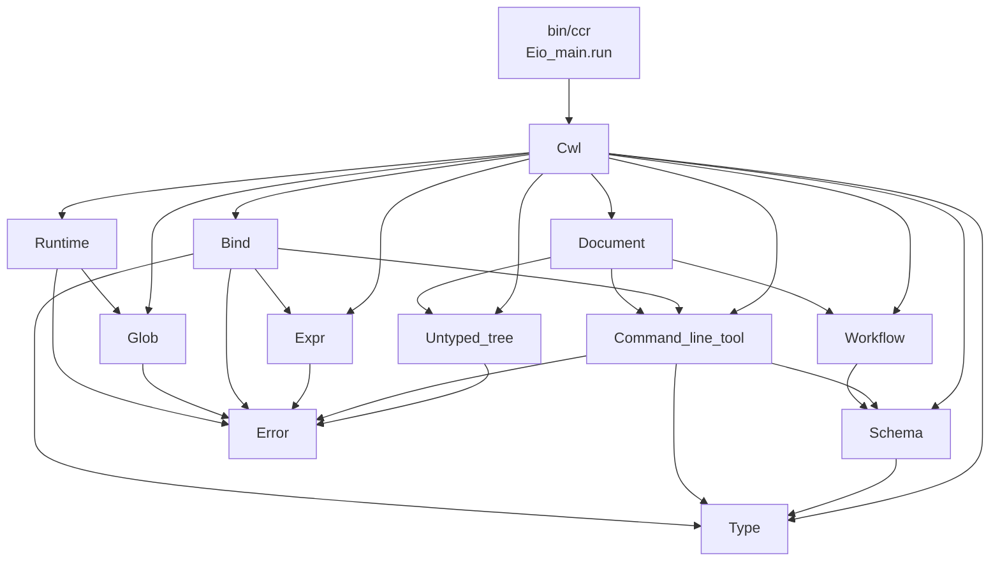
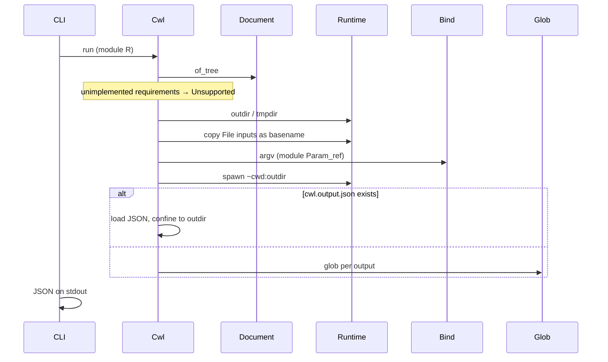

# caml-cwl-runner

A CWL v1.2.1 runner in OCaml 5.5. Binary: `ccr`.

`ccr` loads a process and a job, runs the process, and prints the CWL
output object as JSON on stdout. The engine is the sealed library `Cwl`;
`bin/main.ml` starts the Eio scheduler, maps `Error.t` to exit codes, and
prints that JSON. Exit **33** means an unimplemented feature was required
now; other expected failures are exit 1.

Source of truth, in order: CWL v1.2.1 spec
([CommandLineTool](https://www.commonwl.org/v1.2/CommandLineTool.html),
[Workflow](https://www.commonwl.org/v1.2/Workflow.html),
[invocation.md](https://github.com/common-workflow-language/cwl-v1.2/blob/main/invocation.md))
→ v1.2 conformance tests → cwltool only for a disputed corner.

Contracts live in `lib/*.mli`. Private ADTs live once in `lib/data.ml`
and are `include`d into `Cwl.Error`, `Cwl.Untyped_tree`, `Cwl.Type`,
`Cwl.Command_line_tool`, `Cwl.Workflow`, `Cwl.Document`, `Cwl.Expr`. If
this file and an `.mli` disagree, the `.mli` wins.

---

## How to read the tree

Start at `lib/cwl.mli`: `command_line` builds argv; `run` executes.
Each `lib/*.mli` is the module’s contract. `lib/cwl.ml` is CommandLineTool
execute. `bin/main.ml` is flags plus `Eio_main.run` — no CWL logic.

`(module R)` on `Cwl.run` is a capability (filesystem + spawn) passed in,
not a global. `let*` is `Result.bind`. Tests pack a fake `RUNTIME` or
`Glob.FS`; spawn tests wrap `Eio_main.run`.

Effectful holes are module arguments: `(module Expr.ENGINE)`,
`(module Glob.FS)`, `(module Runtime.RUNTIME)`, `(module Untyped_tree.FILE)`.
Not an IO monad. Stdlib + `Result.t`. I/O only in `Untyped_tree` (load)
and `Runtime` (FS + spawn). Eio is the Runtime body and the CLI scheduler.
No Lwt. Known-unimplemented CWL is a `diagnostic`, never a silent drop.

Salad compact forms (`T?`, `T[]`) are decoded by hand from
`Untyped_tree.value`. No ppx derivers.

---

## Module map

| Module | Role |
|---|---|
| `Error` | Failure (`Error.t`) vs parsed-but-unimplemented (`diagnostic`). `in_requirements` is fatal at **execute**, not at argv. |
| `Untyped_tree` | Nested YAML/JSON file contents, before CWL types. Does not leak `Yaml.value`. |
| `Type` | Avro-ish types and runtime values. Optionality is `Union`. Nested array `inputBinding` is `item_binding` here so Schema can depend on Type. |
| `Schema` | Shared process fields and their parsers: inputs, outputs, requirements. Not a process class. |
| `Command_line_tool` | Typed CommandLineTool. Unknown or unimplemented keys become diagnostics; they are not dropped. |
| `Workflow` | Typed Workflow. Parse only; graph execution is not here. |
| `Document` | Process file: `Command_line_tool` or `Workflow`. [of_tree] reads `class`. Not the job input object. |
| `Expr` | Parameter-reference `ENGINE`. JavaScript is a second `ENGINE`, not a new Bind parameter. |
| `Bind` | `inputBinding` → argv. Does not open files. |
| `Glob` | POSIX/Python glob against `(module FS)`. Does not spawn. |
| `Runtime` | Stage, temp dirs, spawn, confinement. Local body is Eio. |
| `Cwl` | Facade: `command_line` and `run`. |

`Type` does not depend on `Command_line_tool`. `Glob` does not depend on `Runtime`;
Runtime implements `Glob.FS`.

`Error.t` means this call cannot produce a result. A `diagnostic` means
the construct was parsed and is not implemented. Hints keep
`in_requirements = false` and execution proceeds. CLI: `Unsupported` → 33;
other `Error.t` → 1.

---

## CommandLineTool execute

`ccr [--outdir DIR] [--quiet] [--version] PROCESS JOB`. JSON owns stdout.
Tool stdout/stderr are files in `outdir`. `--outdir` omitted → `mkdtemp`,
left on disk. `--quiet` hides diagnostics, not errors.

Load process (`Untyped_tree` → `Document`) and job (`Untyped_tree` →
`Type.object_`). `Workflow` is `Unsupported` until `Cwl.Wf`. Other
`class` → `Unsupported`. A requirement that is unimplemented is
`Unsupported` at execute; the same class in hints is a diagnostic.
Create `outdir` and `tmpdir`. Type-check the job, then stage: File
inputs are **copied** into `outdir` under `basename` (`path` becomes that
basename so argv matches cwd). Directory inputs keep the resolved source
path and are not copied. Basename collision is `Error.Runtime`. Copies
are regular files only (`stat` after follow). File basename, stdout,
stderr, and stdin names are a single path segment (`safe_leaf`): not
empty, not `.`/`..`, no `/` or `\`. Stdio opens do not follow a
pre-existing destination symlink.

`Bind.argv (module Expr.Param_ref)` builds the command line (invocation.md:
position, prefix, `itemSeparator`, `separate:false`, nested array
`item_binding`). `Cwl.command_line` stops here — argv tests and execute
tests have different oracles. Spawn uses **child** cwd = `outdir`. Exit
code must be in `successCodes` (default `[0]`).
`temporaryFailCodes` / `permanentFailCodes` are diagnosed unimplemented.

Then either:

- **`cwl.output.json` present** — that object is the result; `outputBinding`
  is ignored (including `outputEval`). Relative File/Directory `path` /
  `location` resolve against `outdir`. Confined to **outdir only**.
  Declared outputs are `Type.matches`. A JSON File whose path is a
  directory (or a Directory whose path is a file) is `Error.Type`.
- **else** — if an outputBinding still names `outputEval` or `loadContents`,
  `Unsupported`. Otherwise glob. `type: stdout`/`stderr` glob the stream
  filename (`cwl.stdout` if unnamed). Hits: one File, optional miss →
  `null`, required miss → `Error.Runtime`, several on a scalar → error,
  `File[]` may be empty. Directory vs File is `Error.Type`.
  `secondaryFiles` is a diagnostic; the glob hit is still the File.

A string that mixes text and parameter references is interpolated.
`\$(`, `\${`, and `\\` are escapes. A sole `$(…)` keeps its type.
`${…}` or a `$(…)` that is not a parameter reference is
`Unsupported { feature = "InlineJavascriptRequirement" }`.
`runtime.cores` comes from `ResourceRequirement.coresMin` (requirements,
else hints, else `1.`).

Emitted Files include `location` (`file://…`), `path`, `basename`,
`nameroot` / `nameext` (from `basename`; no dot → `nameext` `""`), and
`size`. No checksum until SHA-1 exists (`Digest` is MD5). Empty outputs
are `{}`. JSON is hand-written from `Type.value`.

Eio is the Runtime body because `Unix.create_process` cannot set child
cwd and a process-global `chdir` races with future Workflow fibers.
`DockerRequirement` in requirements selects `Runtime.docker`. The image is
one of `dockerPull`, `dockerImageId`, `dockerLoad`, `dockerImport`, or
`dockerFile` (Dockerfile contents). `dockerPull` wins when it is set; the
others are a single source, and `dockerImageId` names the imported or
built image when it accompanies them. No image, a non-string field, or
more than one acquisition field is a schema error. `dockerOutputDirectory`
is optional. When set it is a canonical absolute container path other than
`/`: no empty segment, no `.` or `..` segment, no `:` (that would be a
`docker -v` option), and no control character. `runtime.outdir` and the
container workdir are that path, and the host outdir is bind-mounted
there. The volume source is `realpath` of the host outdir. A repeated
`DockerRequirement` is a schema error. A staged file's `location` is the
container path; `path` stays the basename. Globs and `cwl.output.json`
paths under the container directory are read on the host; a `..` segment
is not rewritten. When the field is absent the mount target is the host
path, so `runtime.outdir` is that path. The CWL argv is the exec form.
The same class in hints is a diagnostic and the run stays on
`Runtime.local`.

### Confinement

Legal roots: `realpath` of `outdir`, `tmpdir`, and every Directory input’s
resolved source. After `Cwl.run` returns `Ok`, every File/Directory `path`
and `location` in the output object (declared **and** extra JSON keys),
once `file://` is stripped and resolved, realpath-descends from a legal
root. “Under root” is `path = root` or `path` starts with `root ^ "/"`
(so `/out` does not accept `/out-evil`).

`cwl.output.json` paths are checked against **outdir only**. Glob hits
use the full root set. A symlink *name* under `outdir` may match; building
the File object then realpaths the hit, and a target outside the roots is
`Error.Runtime`. Glob never `read_dir`s a tree whose realpath is outside
those roots.

---

## Glob

`Cwl.Glob` is the walker. Runtime only implements `FS`. Spec: POSIX
glob(3) relative to the output directory. Conformance matches Python
`glob.glob` on `os.path.join(outdir, pattern)`, not bash.

| Feature | Behaviour |
|---|---|
| `*` `?` `[…]` | yes (`Re.Glob`) |
| `*` `?` do not match `/` | `~pathname:true` |
| leading `.` not matched by `*`/`?` | `~period:true` |
| backslash escapes | yes |
| brace `{a,b}` | off (not POSIX glob(3)) |
| `**` | walker, depth-capped |
| pattern starting with `/` | `Error.Runtime`, except a pattern that *is* `root` (`$(runtime.outdir)`, `.`) |
| `..` after join | `Error.Runtime` |
| missing matches | `[]` |
| several patterns | concatenated, then unique |

`$(runtime.outdir)` as a glob evaluates to `root`; glob of `.` returns
`[root]` (Directory outputs). Tests use an in-memory `FS`.

---

## Not built yet

Unimplemented CWL stays on the process record as diagnostics. The types are not
deleted.

- **JavaScript** — `module Js : ENGINE`. Same `eval`. `Cwl.run` / `Bind.argv`
  pass it instead of `Param_ref` when `InlineJavascriptRequirement` is
  required or a non-param expression is evaluated. `outputEval` uses
  `self` = glob result (glob → loadContents → outputEval → secondaryFiles).
- **InitialWorkDir** — literal listing is Runtime work before spawn;
  listing expressions wait for JS.
- **Workflow** — a graph of steps on the same Eio scheduler. Each step
  gets its own `outdir` and `Cwl.run`. ExpressionTool is `ENGINE.eval`,
  no spawn.
- **`cwl-runner`** — second public name of `ccr` for `cwltest`. The
  `cwl-v1.2` tree is a git submodule used to run that suite, added when
  that entrypoint exists.

`$import` / `$include` / `$graph`: diagnostic, and `Unsupported` if a
process cannot be chosen without them.

---

## Tests

Alcotest only. QCheck2 via `qcheck-alcotest`. No ppx generators.
Invariants in types and signatures first (no Yaml past `Untyped_tree`; Bind cannot
load files; Glob cannot spawn). Argv examples (`bwa-mem-tool.cwl`,
`cat1-testcli.cwl`, `binding-test.cwl`) are not executed. Execute fixtures
are local (`echo`, `touch`, `true`, `sh -c`). `execute_edges` is one table
over those files.

---

## Open product questions

Current default in parentheses.

1. Checksum on File objects — omit until SHA-1 exists.
2. `--rm-tmpdir` — leave dirs, or delete temp outdirs on success.
3. Unspecified tool stderr — `/dev/null`, or inherit `ccr` stderr.
4. Directory input staging — resolved source path, no copy, or recursive
   copy with InitialWorkDir.

---

## References

- CWL v1.2 CommandLineTool, Workflow, Process; [invocation.md](https://github.com/common-workflow-language/cwl-v1.2/blob/main/invocation.md)
- `lib/cwl.mli` — public surface
- `lib/data.ml` — ADTs
- `AGENTS.md` — project constraints
